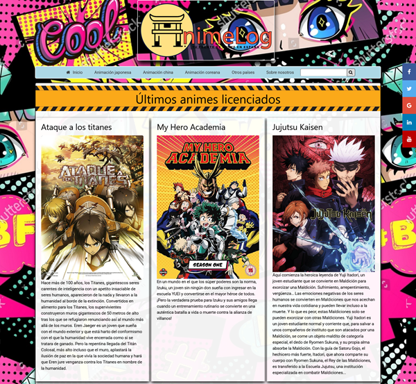
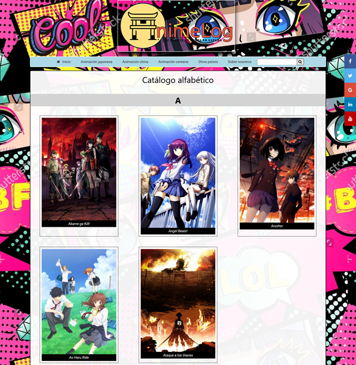
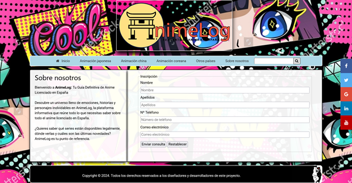
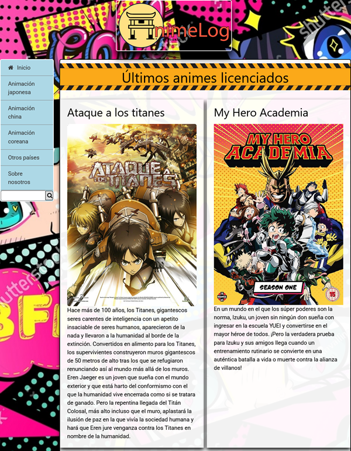
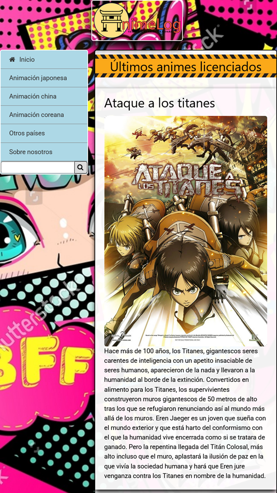
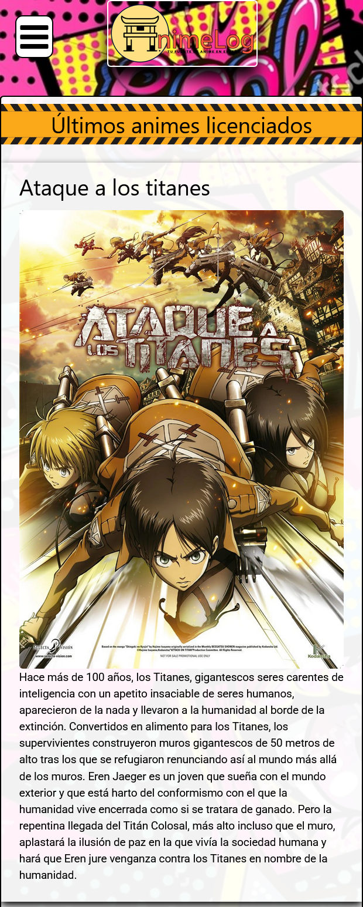

# Proyecto web 1er Trimestre, 1º ASIR 2024/25

Este repositorio contiene todos los archivos y recursos utilizados para el desarrollo del Proyecto Web de 1er trimestre creado por Alejandro Villa Mero y Mauricio Adrián Santos Marco, ambos alumnos de 1er curso de _Administración de Sistemas Informáticos y Redes_ en el CIFP Virgen de Gracia.

## Objetivos

El objetivo de este proyecto es el de desarrollar un sitio web que cumpla con los requisitos del módulo, detallados en la siguiente sección.

## Requisitos

De acuerdo a lo aprendido a lo largo del trimestre, los requisitos que debe cumplir el sitio web son los siguientes:

* La página debe tener un aspecto profesional.
* Debe contar con un menu de navegación y un formulario. Opcionalmente, también se permiten agregar submenús. 
* Se deben crer al menos 6 archivos `.html` y un único `.css`, que debe ser externo.
* La hoja de estilos debe estar debidamente comentada e indentada, indicando de manera organizada la finalidad de las reglas.
* La página de inicio debe llamarse `index.html`.
* Se deben incluir elementos no vistos en clase, investigados por los propios alumnos.

## Estructura

La siguiente tabla muestra la estructura jerárquica de directorios que componen el proyecto, junto a una breve descripción de sus contenidos.

| Directorio | Contenido |
|:-----------|:----------|
| estilos | Contiene el archivo `estilos.css` en el cual se definen todos los estilos aplicados en el sitio mediante CSS. |
| fuentes | Destinada a almacenar los archivos necesarios en el caso de que se utilizen fuentes de texto externas. En este caso, no se ha utilizado ninguna. |
| html | Contiene los archivos `catalogo-anime-china.html`, `catalogo-anime-corea.html`, `catalogo-anime-india.html`, `catalogo-anime-japon.html`, `catalogo-anime-pakistan.html`, `catalogo-anime-usa.html`, `index.html` e `inscripcion.html`, en los cuales se define la estructura del contenido de las diferentes páginas de la web mediante HTML5. |
| imagenes | Dentro se encuentran todas las imágenes utilizadas en el sitio. También se encuentra la carpeta `abc`, que contiene una carpeta por cada letra del abecedario para facilitar la indexación de las diferentes imágenes a la hora de gestionar el compendio alfabético. |
| scripts | En ella se almacenan los scripts externos utilizados en la web. En este caso se encuentra el archivo `script-boton.js`.

## Temática

La temática escogida en el caso del grupo fue **Arte**. En primera instancia se barajó la posibilidad de crear una web acerca de una galería de arte urbano ubicada en Puertollano, pero tras un tiempo y viendo la dificultad de recopilar contenido suficiente se llegó al nexo común de la animación japonesa como arte, lo que condujo a crear una página enciclopédica que recopile aquellas series licenciadas en España y disponibles para su visualización.

## Utilidades del sitio

El objetivo principal de la página, en adelante AnimeLogTM, es el de servir como una base de datos que recopile los animes que pueden verse de una manera u otra en territorio español, clasificados según su país de origen. Si bien existen otras páginas similares, aunque no muchas que sigan activas, la mayoría ignora aquellas animaciones procedentes de otros países que no sean Japón al no considerarlos como tal “anime” propiamente dicho. AnimeLog plantea no hacer ese tipo de diferencias.

>[!NOTE]
>Algunas webs que se han tomado como referencia son:  
>* [Anime Licenciado](https://www.animelicenciado.es/)
>* [MisionTokyo](http://misiontokyo.com/)
>* [Ramen Para Dos](https://ramenparados.com/)

## Logotipo/favicon

  
_Logotipo 2: Logo favicon de AnimeLog._

## Capturas

  
_Captura 1: Página principal (Formato escritorio)_

  
_Captura 2: Catálogo (Formato escritorio)_

  
_Captura 3: Sobre nosotros e Inscripción (Formato escritorio)_

  
_Captura 4: Página principal (Formato de tablet)_

  
_Captura 5: Página principal (Formato de tablet pequeña)_

  
_Captura 6: Página principal (Formato móvil)_

## Costes aproximados y desarrollo

Por último, en esta sección se establecen los costes aproximados[^1] que podría tener el desarrollo y la implementación de un sitio web de estas características.

| Categoría | Descripción | Coste |
|:----------|:------------|:------|
| Diseño Web | Creación del diseño, estructura y maquetación visual | 800 € - 2.500 € |
| Desarrollo Web | Programación del backend, frontend y funcionalidades necesarias (CMS, base de datos, etc.) | 1.000 € - 3.000 € |
| Dominio (.es, .com, etc.) |	Adquisición del dominio para la web |	10 € - 30 € anuales |
| Alojamiento web	| Servidor donde alojar la web, el precio varía dependiendo de si es compartido o dedicado | 50 € - 200 € anuales |
| Certificado SSL	| Certificado para seguridad HTTPS | 20 € - 100 € anuales |
| Soporte técnico	| Mantenimiento técnico de la web (corrección de errores, actualizaciones de software) | 50 € - 200 € mensuales |
| Marketing digital	| Campañas de publicidad, posicionamiento en buscadores (SEO), redes sociales, etc. |	300 € - 1.000 € mensuales |
| Gestión de redes sociales	| Creación y gestión de cuentas en redes sociales, generación de contenido | 200 € - 500 € mensuales |
| Herramientas de análisis (Google Analytics, etc.)	| Coste de herramientas para analizar tráfico web, comportamiento de usuarios, etc.	| 0 € - 50 € mensuales |

En resumen, se podría indicar que el costo aproximado del desarrollo y mantenimiento de la web sería el siguiente:
* Costes de desarrollo inicial: 1.860 € - 5.230 €
* Costes de mantenimiento anual: 1.250 € - 4.850 €
* Costes mensuales de mantenimiento: 1.000 € - 2.700 €

[^1]: Los costes calculados no son definitivos y pueden variar en función de múltiples factores, como el tipo de alojamiento web o la integración de funcionalidades extra como una herramienta multiidioma.
